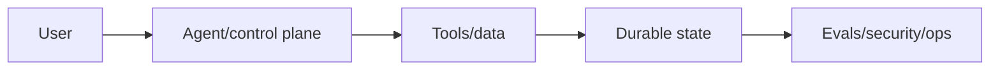
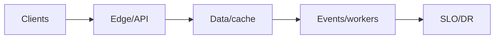

# Day 60 — AI Engineering capstone + System Design capstone

!!! tip "Daily reps (~60–90 min)"
    Do both cards. Run each DO THIS lab, answer each checkpoint aloud before rereading.

## AI card — AI Engineering capstone

**What to learn, in order:** Prove that the 60 days form one system mental model rather than 60 disconnected facts.

**Linear learning path**

1. Design agent loop and tool contracts
2. Define context/state/memory/artifacts
3. Add evals, tracing, budgets, security
4. Plan rollout, degradation, and incident response

!!! example "DO THIS"
    From a blank page, design a production AI Research Engineer Agent that can search, read files, run code, work for hours, cite evidence, and resume after failure.

!!! question "Mid-senior checkpoint"
    What must remain correct even when the model is wrong?

**Sources**

- Required: [A Practical Guide to Building AI Agents - OpenAI](https://openai.com/business/guides-and-resources/a-practical-guide-to-building-ai-agents/) — Production-oriented overview of when to use agents, how to orchestrate them, and how to apply safeguards.
- Official / deep: [API Deployment Checklist - OpenAI](https://developers.openai.com/api/docs/guides/deployment-checklist) — Current deployment checklist spanning model choice, reasoning budgets, tools, compaction, caching, and reliability.

---

## System Design card — System Design capstone

**What to learn, in order:** Design a real product from requirements through capacity, data, async flows, consistency, reliability, observability, deployment, and failure drills.

**Linear learning path**

1. Clarify requirements and scale
2. Choose data ownership/consistency
3. Design sync + async paths
4. Define failure/degradation/DR

!!! example "DO THIS"
    Design a 10M-user collaborative AI learning platform, then inject region loss, DB replica failure, Kafka lag, and 3x traffic.

!!! question "Mid-senior checkpoint"
    What keeps working, what degrades, what is shed, and what must never become inconsistent?

**Sources**

- Required: [AWS Architecture Center](https://aws.amazon.com/architecture/) — Broad reference collection for real cloud architectures, patterns, scaling, and operational trade-offs.
- Official / deep: [Monitoring Distributed Systems - Google SRE](https://sre.google/sre-book/monitoring-distributed-systems/) — Introduces latency, traffic, errors, saturation, and symptom-oriented monitoring.

---
*Source: `60_Days_AI_Engineering_System_Design_Roadmap_Anup_Dangi.pdf`, Day 60 cards. [Suggest a correction](https://github.com/AnupDangi/learnlikeadev/issues/new)*
